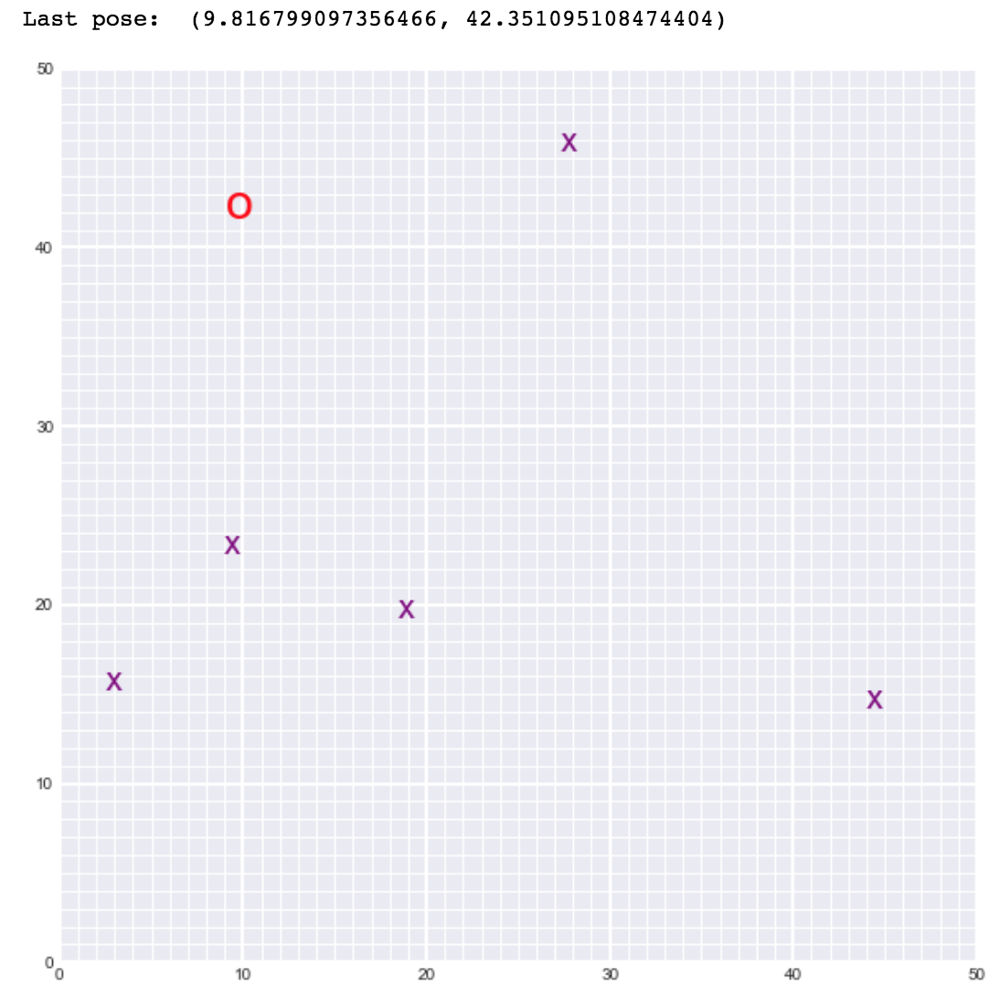

# Landmark Detection and Tracking (SLAM)

SLAM, stands for simultaneus localization and mapping, is a commonly used method to help robots map areas and find their way. 

## Project Overview

If I have a robots on an centain areas which are a two-dimensional space with landmarks around it, in principle in the view of the robots, a robots don't know its location and so the information about its surrounding environtment. Therefore, the first step which we should consider is to make a robots know where they are and whether there is a landmark or not in their surrounding. To get around, a robots rely on what's known as simulataneous localization and mapping or SLAM to discover and map their surroundings. Using SLAM, robots build their own maps as they go. It lets them know their position by aligning the sensor data they collect with whatever sensor data they’ve already collected to build out a map for navigation. The mapping is illustrated in the following

  

This project is provided by Udacity's nanodegree program which the name of the course is [computer vision](https://www.udacity.com/course/computer-vision-nanodegree--nd891). You can enroll it for free by applying some scholarship or others.

In this project, we examine the robot's location over time in two-dimensional space and map their surroundings using elements of probability, motion models and linear algebra. This method will update their motion and sense the environtment simultaneously. The robot world is displayed in the following figure

  

## Implementations

Since the overal code is written using jupyter-notebook, to hands on you just have to click `3. Landmark Detection and Tracking.ipynb` file and execute each cell.
